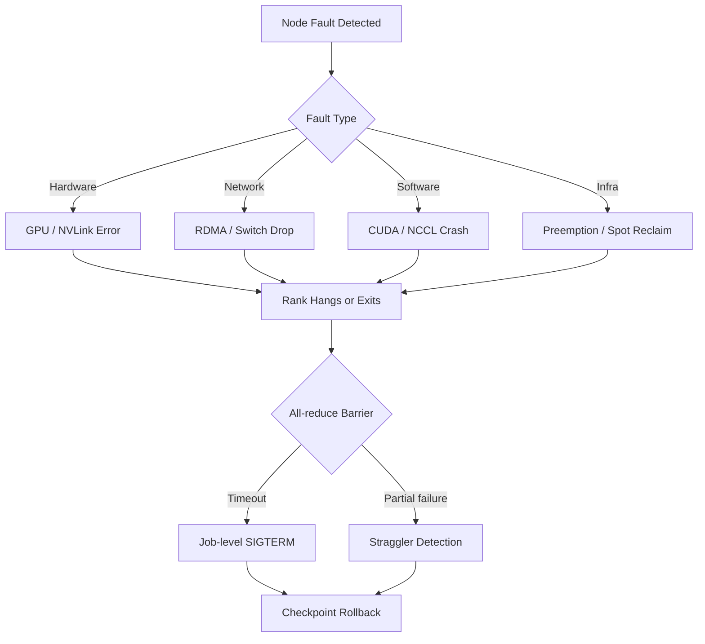
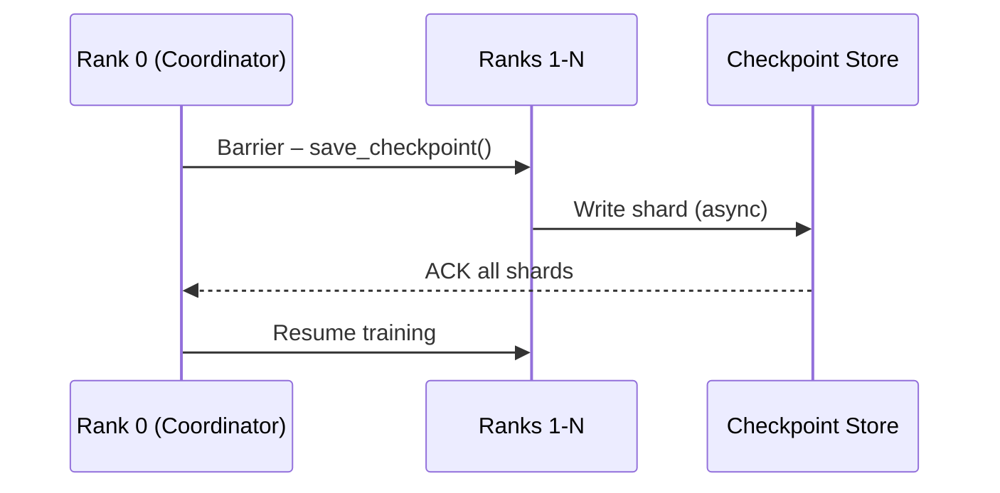
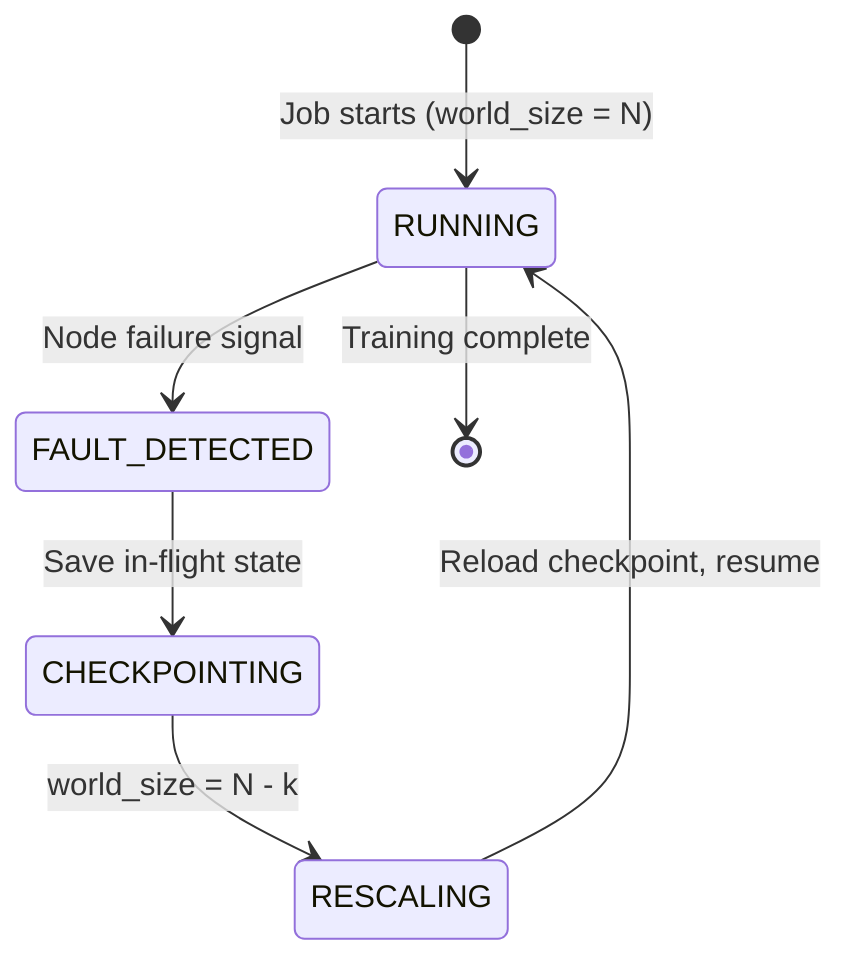
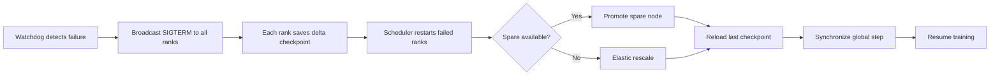
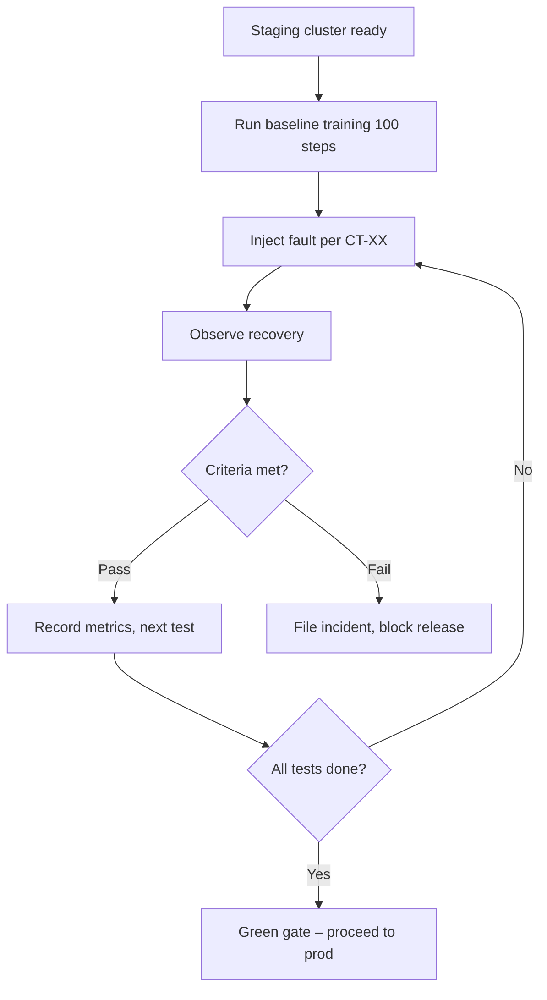

# Fault Tolerance Design for Distributed AI Training

This document describes the fault-tolerance architecture for large-scale distributed training systems.

---

## Table of Contents

1. [Failure Modes](#1-failure-modes)
2. [Redundancy Strategies](#2-redundancy-strategies)
3. [Recovery Mechanisms](#3-recovery-mechanisms)
4. [Chaos Tests](#4-chaos-tests)

---

## 1. Failure Modes

Distributed training jobs span hundreds to thousands of accelerator nodes. Any node may fail at any time. The failure taxonomy below covers the most common root causes.

| Category | Examples | Impact |
|----------|----------|--------|
| **Hardware** | GPU ECC error, NVLink hang, host OOM | Single node or rack |
| **Network** | RDMA link drop, switch failure, packet loss | Rank group or entire job |
| **Software** | CUDA kernel crash, NCCL timeout, Python OOM | Single rank or all-reduce hang |
| **Infrastructure** | Preemption, spot reclaim, scheduler restart | Entire job |

### Failure propagation



---

## 2. Redundancy Strategies

### 2.1 Checkpoint replication

Model state is periodically saved to a replicated store. Two complementary strategies are used:

| Strategy | Interval | Storage | RTO |
|----------|----------|---------|-----|
| **Full checkpoint** | Every N steps (e.g. 500) | Distributed object store | Minutes |
| **Incremental / delta** | Every M steps (e.g. 50) | Local SSD + async sync | Seconds |



### 2.2 Elastic training

The job adjusts its world size when nodes leave or join:



### 2.3 Spare node pool

A fraction of nodes (typically 5–10 %) is kept warm as cold standbys. When a failure occurs, a spare is promoted and the job re-partitions the model without changing the nominal world size.

---

## 3. Recovery Mechanisms

### 3.1 Recovery flow



### 3.2 Mean-time metrics

| Metric | Target |
|--------|--------|
| **MTTD** (detection) | < 30 s |
| **MTTC** (checkpoint save) | < 60 s |
| **MTTR** (full recovery) | < 5 min |

### 3.3 Checkpoint integrity

Before resuming from a checkpoint the coordinator verifies:

1. **Hash check** – SHA-256 of each shard matches the manifest.
2. **Step consistency** – All shards report the same `global_step`.
3. **Optimizer state** – Momentum buffers and scalar statistics are present.

If verification fails the system rolls back to the previous full checkpoint.

---

## 4. Chaos Tests

Chaos tests are executed in a dedicated staging cluster before each major release.

### 4.1 Test matrix

| Test ID | Scenario | Injection Method | Pass Criteria |
|---------|----------|-----------------|---------------|
| **CT-01** | Single-node crash | `kill -9` on random rank | Job recovers, loss curve continuous |
| **CT-02** | Multi-node crash (10 %) | Simultaneous SIGKILL on k nodes | Elastic rescale within 5 min |
| **CT-03** | Network partition | `iptables` drop between rack A & B | All-reduce timeout, checkpoint, rejoin |
| **CT-04** | Slow node (straggler) | CPU throttle via cgroups | Straggler detected & replaced |
| **CT-05** | Checkpoint corruption | Bit-flip in shard file | Rollback to previous checkpoint |
| **CT-06** | Spot preemption | Cloud API forced reclaim | Graceful drain, resume from checkpoint |

### 4.2 Chaos test pipeline



### 4.3 Simulator usage

The `src/simulator.py` module provides a programmatic interface to run fault injection experiments locally without a real cluster. See the demo in `notebooks/01_fault_demo.ipynb`.

```bash
python src/simulator.py --nodes 8 --fail-rate 0.1 --steps 200
```
